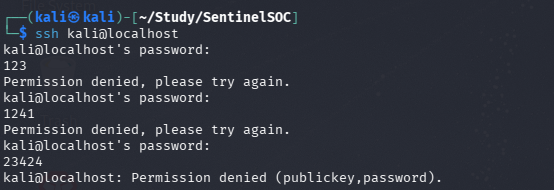
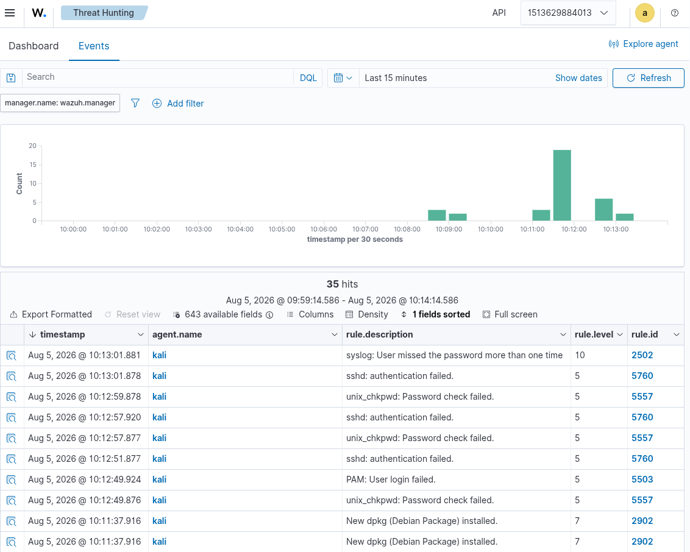
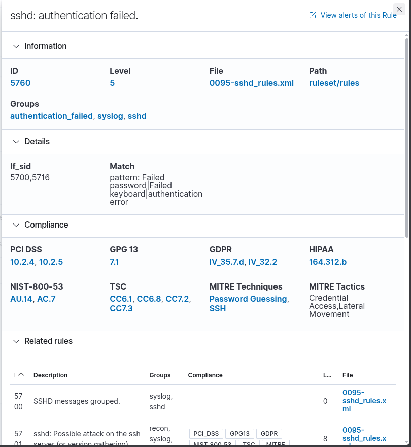
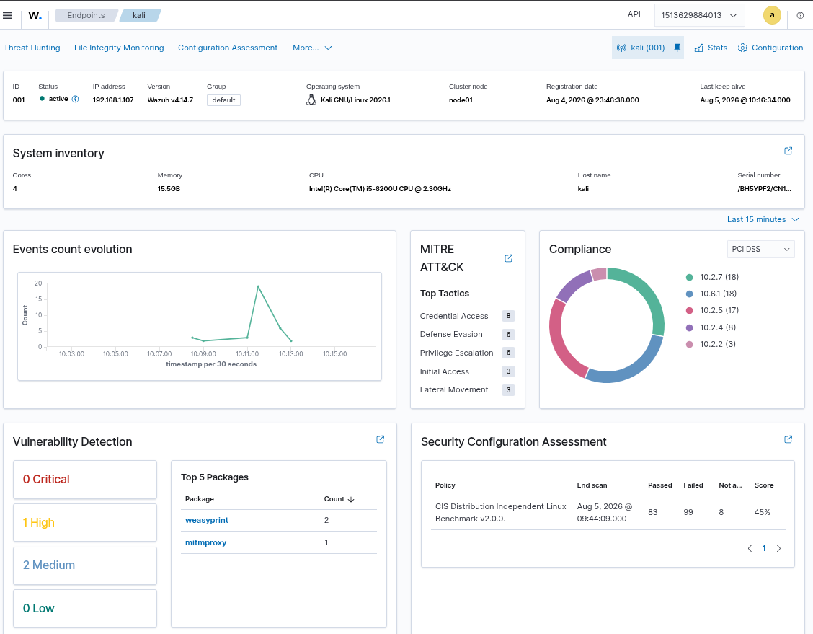
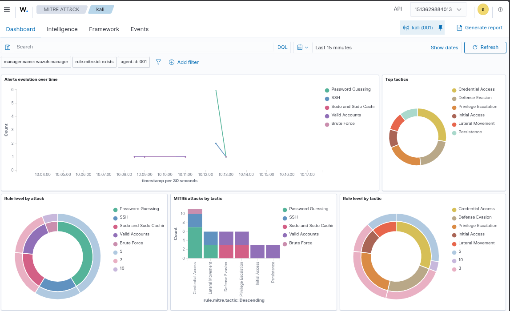

# DET-001 — SSH Brute Force Detection

## Overview

This detection demonstrates how I identified SSH brute-force activity using Wazuh on a Kali Linux endpoint.

The objective of this lab was to generate repeated failed SSH login attempts, verify that Wazuh collected the authentication logs, investigate the generated alerts, and document the complete detection lifecycle.

---

## Objectives

- Generate failed SSH login attempts
- Verify log collection by the Wazuh agent
- Investigate alerts in the Wazuh Dashboard
- Map the activity to the MITRE ATT&CK framework
- Document the detection engineering process

---

## Lab Environment

| Component | Value |
|-----------|-------|
| SIEM | Wazuh 4.x |
| Endpoint | Kali Linux |
| Log Source | /var/log/auth.log |
| Detection | Authentication failures |
| Platform | Docker |

---

## Attack Scenario

An attacker attempts to gain access to the Linux system by repeatedly guessing SSH passwords.

During validation, I manually generated failed SSH login attempts instead of using automated tools. This safely produced authentication failure events without putting unnecessary load on the system.

Detailed attack steps are available in:

- attack.md

---

## Detection Logic

The Wazuh agent monitored authentication logs and forwarded them to the Wazuh Manager.

Authentication failures generated security events that appeared in the dashboard and were available for investigation.

Detection implementation:

- Wazuh Rules
- Sigma Rule

Both rule files are available under:

```
rules/
```

Additional detection details are documented in:

- detection.md

---

## Validation

Validation was performed by manually generating failed SSH login attempts.

The generated authentication failures successfully appeared inside Wazuh Security Events.

The detection was considered successful because:

- Authentication logs were collected
- Security alerts were generated
- Events appeared inside Threat Hunting
- MITRE mapping was available

Complete validation steps:

- testing.md
- validation-checklist.md

---

## Investigation Summary

After the alerts appeared in Wazuh, I investigated:

- Source host
- Authentication failures
- Event timeline
- Rule information
- MITRE ATT&CK mapping

The investigation process is documented in:

- investigation-guide.md

---

## Response

After confirming the activity, the following response actions were considered:

- Identify the attacking source
- Block malicious IP addresses if necessary
- Review SSH configuration
- Review authentication logs
- Continue monitoring for additional attempts

Detailed response workflow:

- response-playbook.md

---

## MITRE ATT&CK

| Tactic | Technique |
|---------|-----------|
| Credential Access | T1110 - Brute Force |

---

## Screenshots

### Attack Execution



---

### Threat Hunting Results



---

### Alert Details



---

### Agent Status



---

### MITRE Mapping



---

## Repository Structure

```
DET-001-SSH-Brute-Force/
├── README.md
├── attack.md
├── detection.md
├── investigation-guide.md
├── response-playbook.md
├── testing.md
├── validation-checklist.md
├── metadata.yml
├── references.md
├── rules/
├── sample-logs/
└── screenshots/
```

---

## References

See:

- references.md

---

## Status

✅ Detection Implemented

✅ Detection Validated

✅ Alerts Generated

✅ Investigation Completed

✅ Documentation Completed
