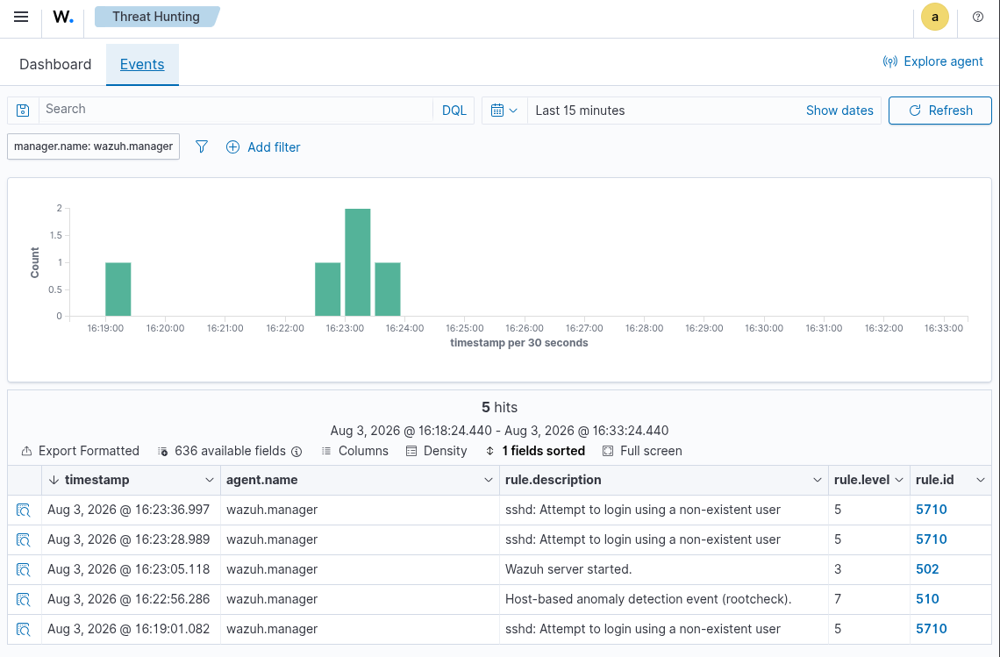
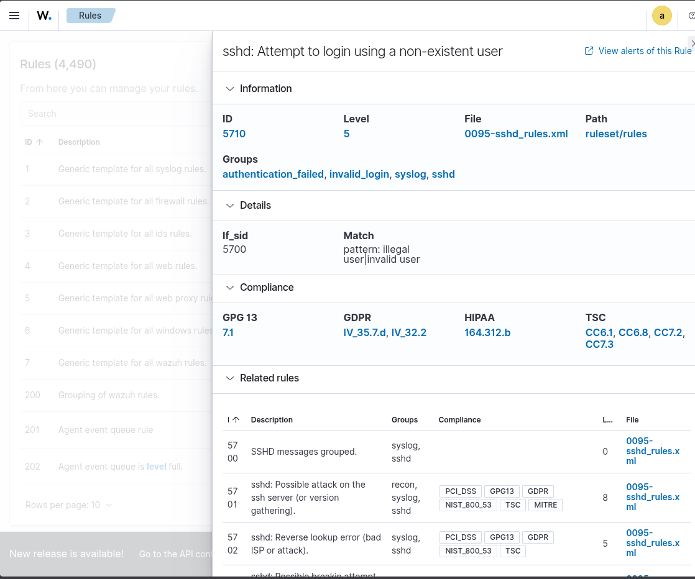
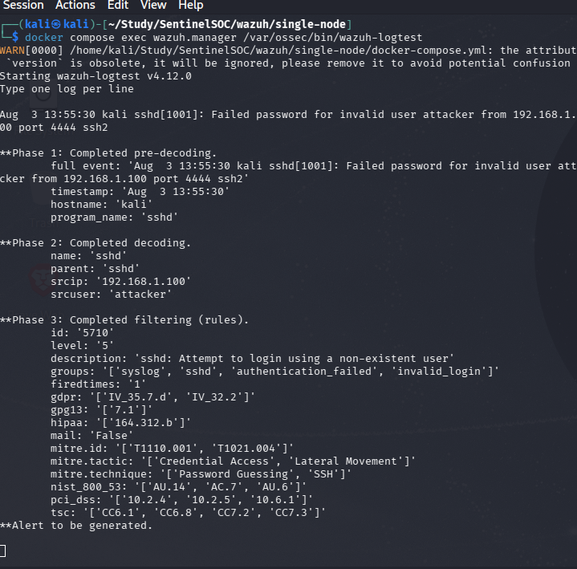
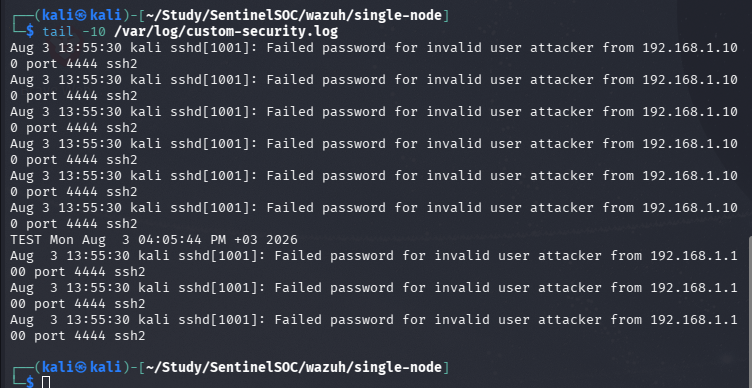

# SSH Brute Force Detection using Wazuh

## Overview

In this lab, I configured Wazuh to monitor a custom log file and detect SSH login attempts. The goal was to understand how Wazuh decodes SSH logs and generates security alerts for failed login attempts.

---

## Objective

- Configure Wazuh to monitor a custom log file.
- Generate SSH failed login events.
- Verify that Wazuh detects the events using its default SSH rules.
- Investigate the generated alerts in the Wazuh Dashboard.

---

## Environment

- Kali Linux
- Docker
- Wazuh Manager
- Wazuh Dashboard

---

## Configuration

I created a custom log file named `custom-security.log` and configured Wazuh Manager to monitor it.

```xml
<localfile>
    <location>/var/log/custom-security.log</location>
    <log_format>syslog</log_format>
</localfile>
```

After updating the configuration, I restarted the Wazuh containers so the changes would take effect.

---

## Testing

To simulate an SSH login attack, I generated a fake failed login event and saved it into the custom log file.

```bash
echo "Aug  3 13:55:30 kali sshd[1001]: Failed password for invalid user attacker from 192.168.1.100 port 4444 ssh2" | sudo tee -a /var/log/custom-security.log
```

I also used **wazuh-logtest** to verify that the log matched the correct decoder and rule before checking the dashboard.

---

## Problems I Faced

This lab did not work correctly on the first attempt.

Initially, Wazuh was reading the custom log file, but every generated event matched **Rule 1002 (Unknown problem somewhere in the system)** instead of the expected SSH detection rule.

To find the problem, I checked several things:

- Verified that the custom log file was being monitored.
- Checked the SSH decoder inside Wazuh.
- Reviewed the `ossec.conf` configuration.
- Removed duplicate log entries from the configuration.
- Verified the custom log file permissions.
- Tested the log using `wazuh-logtest`.

After checking everything, I rebuilt and restarted the Wazuh environment. Once the manager loaded the configuration correctly, the SSH decoder started working as expected.

---

## Result

After fixing the configuration, Wazuh successfully detected the generated SSH login attempt.

The event matched:

- **Rule ID:** 5710
- **Description:** SSHD: Attempt to login using a non-existent user

The alert appeared successfully in:

- Wazuh Dashboard
- Security Events
- Alerts Log

This confirmed that Wazuh was correctly decoding and monitoring the custom log file.

---

## Screenshots

### Security Events



---

### Alert Details



---

### Wazuh Logtest



---

### Custom Security Log



---

## What I Learned

During this lab, I learned how to:

- Configure Wazuh to monitor a custom log file.
- Test log parsing using `wazuh-logtest`.
- Understand how Wazuh decoders and rules work together.
- Troubleshoot log collection and decoding problems.
- Investigate generated alerts using the Wazuh Dashboard.