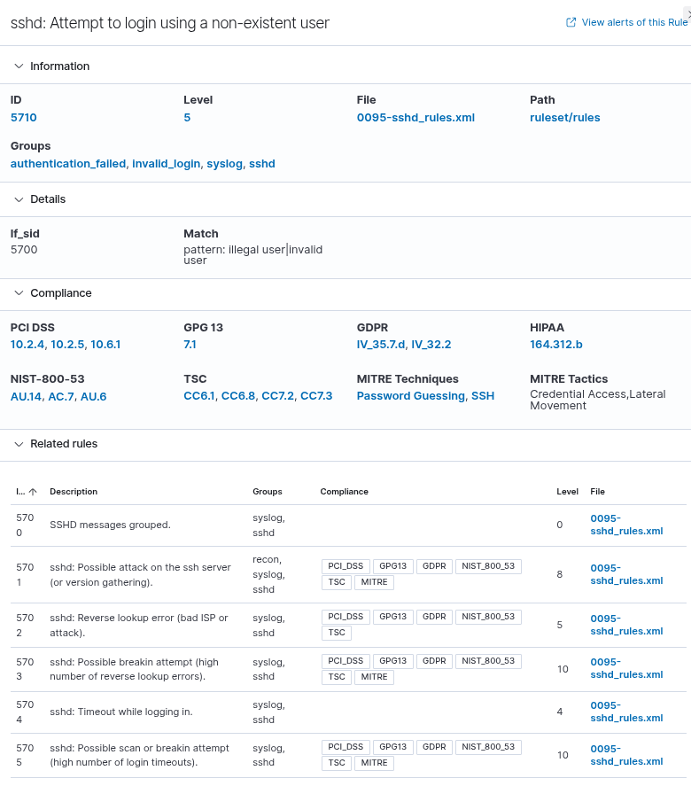
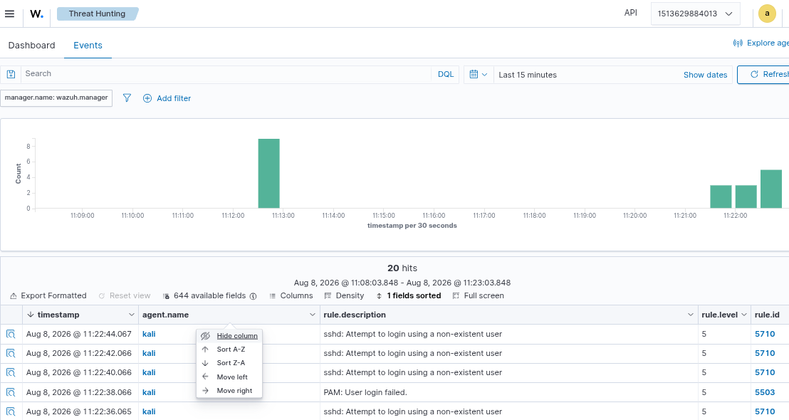
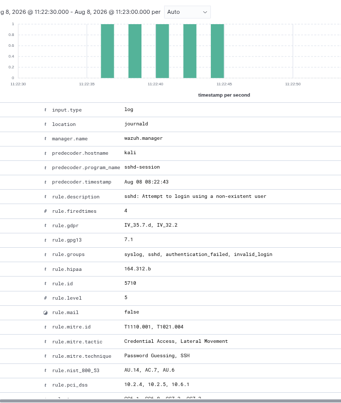

# IR-001 — SSH Brute Force / Authentication Attack

## 1. Incident Overview

| Field            | Value                                   |
| ---------------- | --------------------------------------- |
| Incident ID      | IR-001                                  |
| Incident Type    | SSH Brute Force / Authentication Attack |
| Severity         | Medium                                  |
| Status           | Investigating                           |
| Detection Source | Wazuh                                   |
| Affected Host    | `kali`                                  |
| Target Service   | SSH                                     |
| Source IP        | `::1`                                   |
| Target User      | `fakeuser`                              |
| Wazuh Rule       | `5710`                                  |
| Detection Time   | `2026-08-06 09:59:11`                   |

This incident demonstrates the SentinelSOC incident-response workflow for detecting and investigating repeated SSH authentication failures.

The activity was detected by Wazuh from SSH authentication telemetry generated by the monitored Kali host.

---

## 2. Detection

The investigation started after Wazuh generated an alert for an SSH authentication attempt using a non-existent user.

The relevant Wazuh rule was:

* **Rule ID:** `5710`
* **Description:** SSH attempt using a non-existent user
* **Source user:** `fakeuser`
* **Source IP:** `::1`
* **Target service:** SSH
* **Rule level:** 5
* **Rule groups:** `syslog`, `sshd`, `authentication_failed`, `invalid_login`

The event was observed multiple times, indicating repeated authentication activity rather than a single isolated login failure.

---

## 3. Evidence

### Evidence 1 — SSH Event

The first screenshot shows the Wazuh event associated with the SSH authentication activity.



**Evidence interpretation:**

The event shows an authentication attempt against SSH involving the non-existent account `fakeuser` from source address `::1`.

---

### Evidence 2 — Wazuh Event Search

The second screenshot shows the Wazuh search used to locate the relevant SSH events.



**Search focus:**

```text
rule.id: 5710
```

This allowed the analyst to isolate events generated by the relevant Wazuh detection rule.

---

### Evidence 3 — Raw Event JSON

The third screenshot shows the structured JSON representation of the Wazuh event.



Important fields observed in the event include:

```text
agent.id: 001
agent.name: kali
data.srcip: ::1
data.srcuser: fakeuser
decoder.name: sshd
rule.id: 5710
rule.level: 5
rule.firedtimes: 7
rule.mitre.id: T1110.001, T1021.004
rule.mitre.tactic: Credential Access, Lateral Movement
```

The raw event provides structured evidence that can be correlated with other security telemetry.

---

## 4. Investigation

The investigation followed a simple SOC workflow:

### Step 1 — Identify the alert

Wazuh generated an SSH authentication alert associated with rule `5710`.

### Step 2 — Examine the authentication activity

The underlying SSH logs showed repeated failed authentication attempts involving the non-existent account `fakeuser`.

The observed activity included:

```text
Invalid user fakeuser from ::1
Failed password for invalid user fakeuser from ::1
```

Multiple failed attempts were observed during the same SSH session.

### Step 3 — Determine the affected service

The targeted service was SSH.

The Wazuh decoder identified the event as:

```text
decoder.name: sshd
decoder.parent: sshd
```

### Step 4 — Examine repetition

The Wazuh event contained:

```text
rule.firedtimes: 7
```

This indicates that the detection rule had fired repeatedly for the observed activity.

### Step 5 — Map the activity

Wazuh mapped the event to:

* `T1110.001` — Password Guessing
* `T1021.004` — SSH

The mapping provides a useful framework for understanding the behavior in the context of MITRE ATT&CK.

---

## 5. Timeline

| Time          | Event                                                        |
| ------------- | ------------------------------------------------------------ |
| 09:59:11      | SSH authentication activity observed                         |
| 09:59:13      | Wazuh generated the corresponding alert                      |
| Investigation | Event searched using rule `5710`                             |
| Investigation | Event details and raw JSON reviewed                          |
| Investigation | Evidence preserved through screenshots and incident metadata |

The timestamps and event information are based on the collected Wazuh and SSH telemetry.

---

## 6. Containment

For this controlled SentinelSOC laboratory scenario, the activity was investigated as a simulated authentication attack.

The investigation focused on identifying and documenting the activity rather than disrupting the laboratory environment.

The key containment decision was to preserve the telemetry and investigate the repeated authentication failures before making any destructive changes.

In a production SOC environment, containment could include:

* Blocking the source IP when appropriate
* Restricting SSH exposure
* Disabling or locking compromised accounts
* Applying rate limiting
* Restricting SSH access through firewall controls
* Increasing authentication monitoring

No production containment action is claimed as part of this laboratory exercise.

---

## 7. Eradication

No confirmed compromise was established from the collected evidence.

The observed account was:

```text
fakeuser
```

and Wazuh identified it as a non-existent user.

Therefore, no claim is made that credentials were successfully compromised or that malware was installed.

The laboratory investigation instead demonstrates detection, evidence collection, analysis and incident handling.

---

## 8. Recovery

Because the evidence did not establish a successful compromise, a full system recovery procedure was not required for this laboratory incident.

The monitored Wazuh agent remained operational and continued collecting telemetry.

The agent status was verified as active during the investigation.

---

## 9. Analyst Assessment

### Finding

The evidence supports the conclusion that repeated SSH authentication failures occurred against the monitored host.

The activity involved:

* A non-existent username
* Repeated failed passwords
* SSH as the targeted service
* Wazuh rule `5710`
* Multiple rule firings
* MITRE ATT&CK mappings associated with password guessing and SSH

### Confidence

**Medium confidence** that the observed activity represents password-guessing/brute-force behavior.

### Important limitation

The source address was:

```text
::1
```

which is the IPv6 loopback address.

Therefore, this laboratory event should **not** be presented as evidence of an external attacker.

The event demonstrates the detection and investigation workflow, but it does not establish an external intrusion.

---

## 10. Lessons Learned

This investigation demonstrated several important SOC practices:

1. Security alerts should be investigated using the underlying event data rather than the alert title alone.
2. Repeated authentication failures provide useful behavioral context.
3. Structured Wazuh fields make correlation and investigation easier.
4. MITRE ATT&CK mappings help analysts describe observed behavior consistently.
5. Evidence should be preserved before modifying the environment.
6. A detection does not automatically mean that a compromise occurred.
7. Source context is important when determining whether activity is internal, local or external.
8. Screenshots and structured artifacts provide reproducible evidence for an investigation.

---

## 11. Validation

The incident metadata was preserved as:

```text
artifacts/incident-metadata.json
```

The JSON artifact was successfully validated using Python's JSON parser.

Validation result:

```text
PASS: incident-metadata.json is valid JSON
```

The artifact records the incident ID, severity, source, affected host, source IP, target service, target user, Wazuh rule and MITRE ATT&CK techniques.

---

## 12. Evidence Inventory

| Evidence                | Location                                                 | Purpose                         |
| ----------------------- | -------------------------------------------------------- | ------------------------------- |
| Incident metadata       | `artifacts/incident-metadata.json`                       | Structured incident record      |
| SSH event screenshot    | `screenshots/IR-001-01_Wazuh_SSH_Brute_Force_Event.png`  | Shows detected event            |
| Wazuh search screenshot | `screenshots/IR-001-02_Wazuh_SSH_Brute_Force_Search.png` | Shows event discovery/search    |
| Raw JSON screenshot     | `screenshots/IR-001-03_Wazuh_SSH_Brute_Force_JSON.png`   | Shows structured event evidence |

---

## 13. Final Incident Status

**Status: Investigated — No confirmed compromise**

The SentinelSOC IR-001 workflow successfully demonstrated:

```text
Detection
    ↓
Alert identification
    ↓
Event search
    ↓
Event analysis
    ↓
Evidence preservation
    ↓
MITRE ATT&CK mapping
    ↓
Analyst assessment
    ↓
Incident documentation
```

The exercise demonstrates a complete student-level SOC investigation while maintaining an important distinction between **suspicious authentication activity** and **confirmed compromise**.
