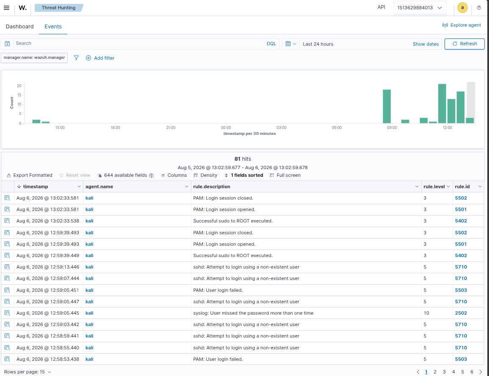
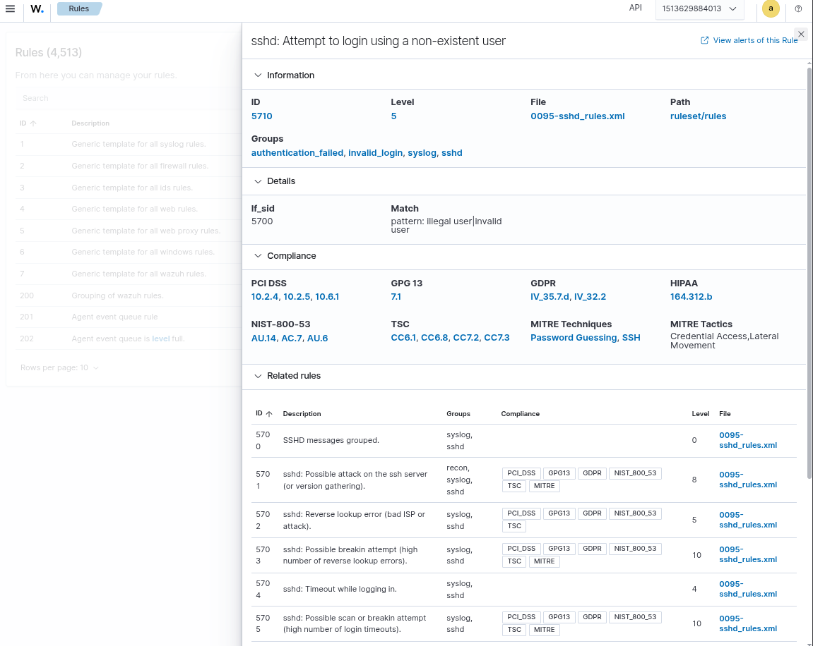
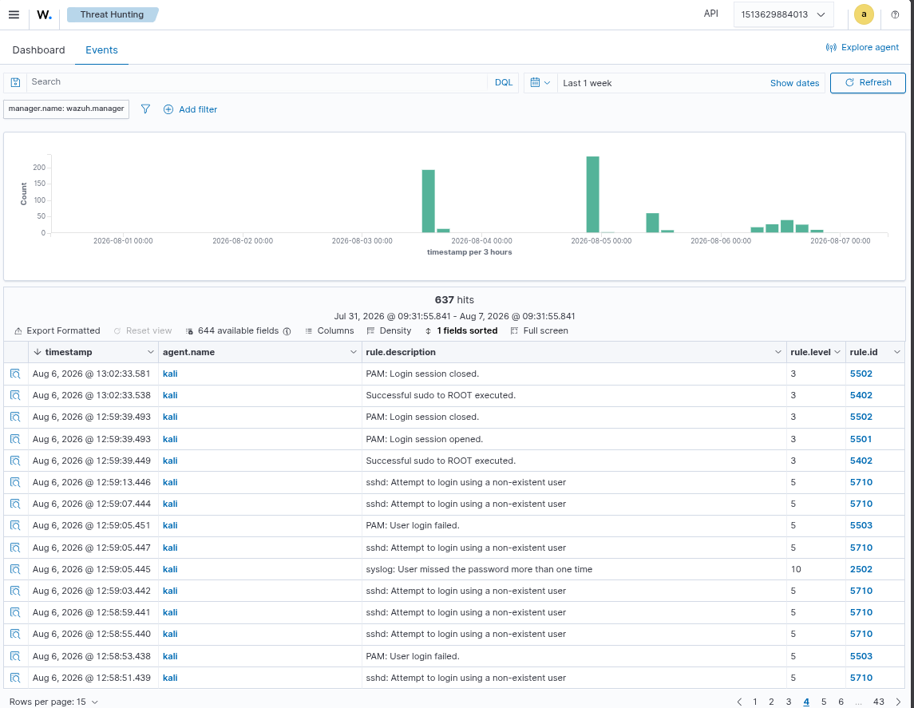

# HUNT-001: SSH Brute-Force Threat Hunt

## Overview

I performed a threat hunt for suspicious SSH authentication activity on my Kali Linux host.

The goal was to determine whether the available Wazuh telemetry contained signs of repeated SSH authentication failures that could indicate brute-force activity.

I used the Wazuh Threat Hunting interface to search and review the available SSH-related events.

## Hunt Objective

I wanted to answer three questions:

1. Are SSH authentication events being collected?
2. Are there repeated failed authentication events?
3. Can I investigate the events and identify useful evidence?

## Data Source

- Host: Kali Linux
- Agent: `kali`
- Platform: Wazuh
- Data source: SSH/authentication telemetry
- Investigation interface: Wazuh Threat Hunting

## Hunting Process

I started by searching the Wazuh telemetry for SSH-related authentication activity.

I reviewed the returned events and inspected individual event details to understand the available fields and timestamps.

I then reviewed the overall event distribution in the Threat Hunting interface.

## Evidence

### 1. SSH Hunt Search

The first screenshot shows my SSH-focused search and the resulting authentication events.

### 2. Event Details

The second screenshot shows the details of an individual SSH event that I investigated.

### 3. Hunt Summary

The third screenshot shows the overall Threat Hunting results, including the search, timeline, event count, and event list.

## Findings

The hunt confirmed that SSH authentication telemetry is available in Wazuh for the Kali agent.

The events provide useful information such as timestamps, agent information, rule information, and authentication-related activity.

The available telemetry can therefore be used as a starting point for identifying repeated SSH authentication failures and investigating potential brute-force behaviour.

## Conclusion

This hunt demonstrated that I can use Wazuh Threat Hunting to:

- define a hunting objective
- search security telemetry
- filter and review relevant events
- inspect individual events
- use timestamps and event fields during investigation
- document findings with supporting evidence

This hunt also provides a foundation for improving SSH brute-force detection and investigation workflows in SentinelSOC.
